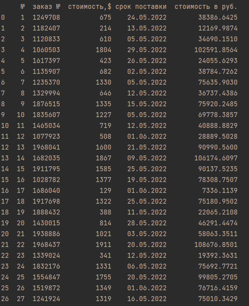

# test_numbers
Необходимо разработать скрипт на языке Python 3, 

который будет выполнять следующие функции:

1. Получать данные с документа при помощи Google API, сделанного в [Google Sheets](https://docs.google.com/spreadsheets/d/1LTejK-Oo7L1bFreBIIcEZnF1W1RCC1s_jos3EuIP0jI/edit?usp=sharing) (необходимо копировать в свой Google аккаунт и выдать самому себе права).
**Сделано**
2. Данные должны добавляться в БД, в том же виде, что и в файле –источнике, с добавлением колонки «стоимость в руб.» **- Сделано**
    
    a. Необходимо создать DB самостоятельно, СУБД на основе PostgreSQL. - **Сделано, выведено в файл createdb**
    
    b. Данные для перевода $ в рубли необходимо получать по курсу [ЦБ РФ](https://www.cbr.ru/development/SXML/). **- Сделано, реализовано в файле project**
    
3. Скрипт работает постоянно для обеспечения обновления данных в онлайн режиме (необходимо учитывать, что строки в Google Sheets таблицу могут удаляться, добавляться и изменяться). **- Реализовано с помощью tgBota**

**Ссылка на таблицу, доступ предоставлен для sales@numbersss.com:**
https://docs.google.com/spreadsheets/d/1hJefBQmQ-r5YHXRKJxxy_26IA2ZlduuKA5-9BEkQ2IA/edit?usp=sharing

